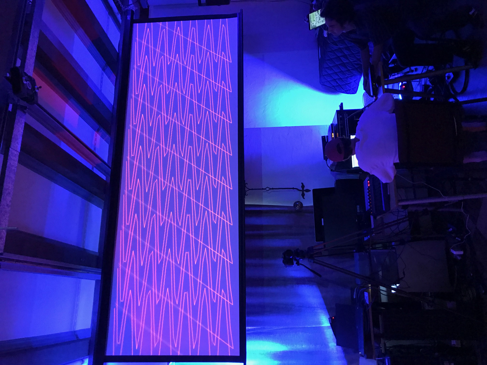
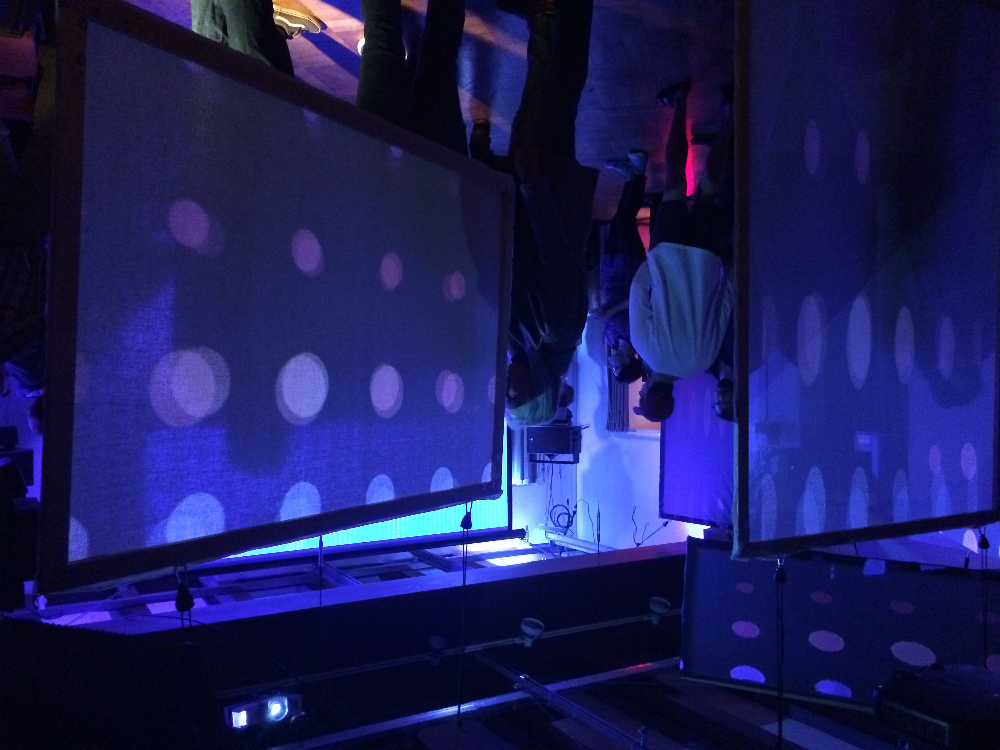

# "Situated Instrument Design for Musical Expression" Interactive Installation | Lighting Component

## Images From the Event

Xbox-Kinect Animation

Projector Screens

Microphone effect

## Credits

**Gregg Oliva** - Lighting

**Rocky Lubbers** - Lighting

**Ryan Hayes** - Sound Design and Effects

**Trevor Van de Velde** - Sound Design and Effects

**Ray Savord** - Color Projection

**Ben Vu** - Animation

**Ryan Burke** - Xbox Kinect Skeletal Data

**William Sheu** - Patch Orchestration
