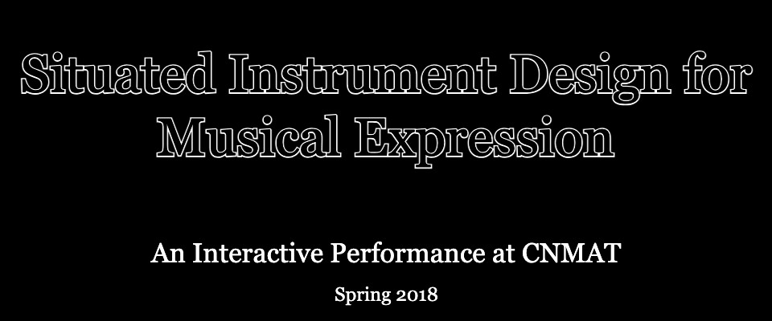

 <!-- markdownlint-disable-line -->

## [Read About the Event from Berkeley Arts + Design](https://artsdesign.berkeley.edu/performing-arts/made-at-berkeley/music-158b-interactive-installation-2018)

## [See The Official CNMAT Event Page for the Performance](https://cnmat.berkeley.edu/events/cnmat-music-158b-collective-presents-interactive-installation)

## Media From the Event

Xbox-Kinect Animation

Projector Screens

Microphone effect

## In The News

[Read About the Event from Berkeley Arts + Design](https://artsdesign.berkeley.edu/performing-arts/made-at-berkeley/music-158b-interactive-installation-2018).

[See The Official CNMAT Event Page for the Performance](https://cnmat.berkeley.edu/events/cnmat-music-158b-collective-presents-interactive-installation).

## Performance Details

Read the **[Performance API Doc](https://docs.google.com/document/d/1U8fV-k4seKrYjmtaWKxeABQZnRE966pL-rQ6-w20oyk/edit?usp=sharing)** for information on the Networking setup, Computer roles and delineation, and OSC Addresses used during the performance.

## Credits

**Gregg Oliva** - Lighting

**Rocky Lubbers** - Lighting

**Ryan Hayes** - Sound Design and Effects

**Trevor Van de Velde** - Sound Design and Effects

**Ray Savord** - Color Projection

**Ben Vu** - Animation

**Ryan Burke** - Xbox Kinect Skeletal Data

**William Sheu** - Patch Orchestration
