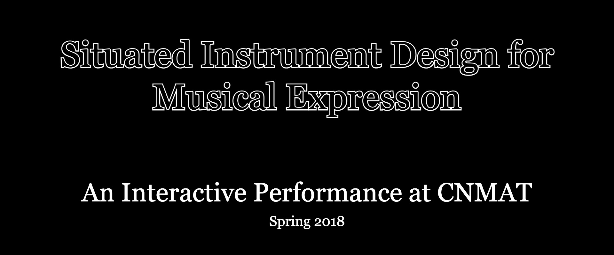
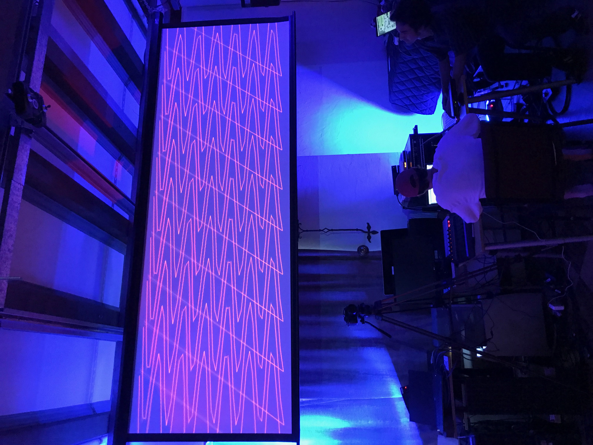
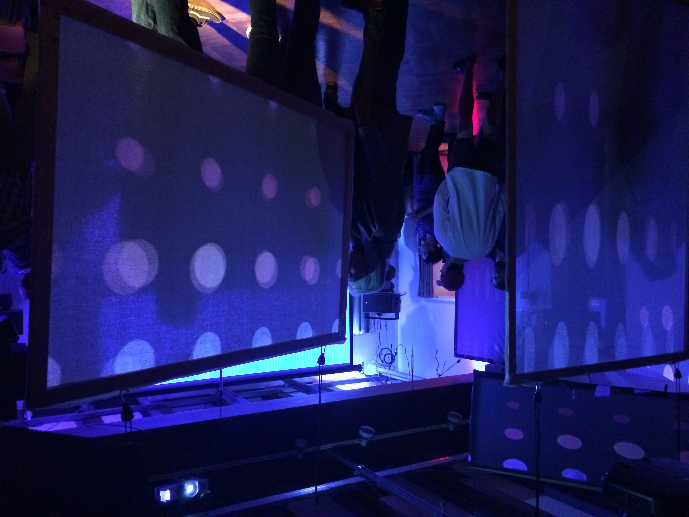
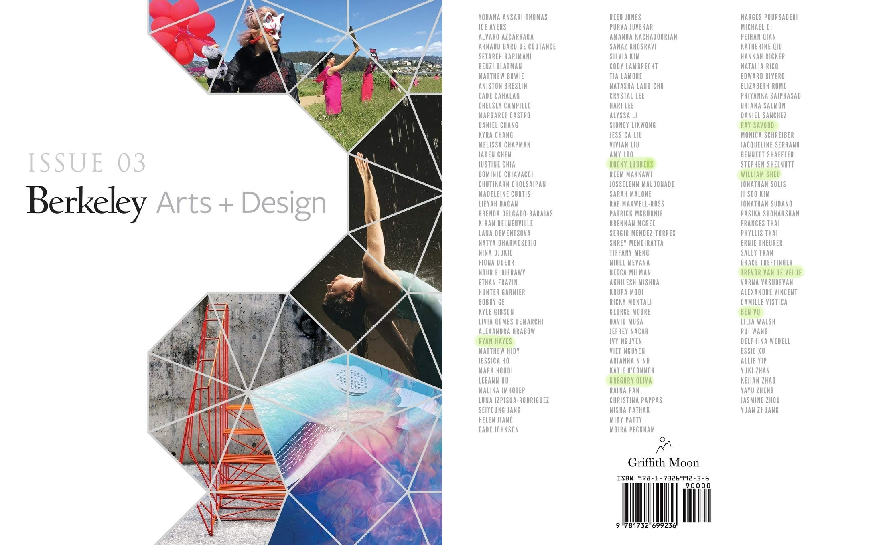

 <!-- markdownlint-disable-line -->

## [Read About the Event from Berkeley Arts + Design](https://artsdesign.berkeley.edu/performing-arts/made-at-berkeley/music-158b-interactive-installation-2018)

## [See The Official CNMAT Event Page for the Performance](https://cnmat.berkeley.edu/events/cnmat-music-158b-collective-presents-interactive-installation)

## Course and Event Overview

As students in the course *Music 158b: Situated Instrument Design for Musical Expression*—taught at UC Berkeley's [Center for New Music and Audio Technology (CNMAT)](https://cnmat.berkeley.edu/)—we developed upon music technology fundamentals by exploring digital instrument design and constructing elaborate performance environments.

Our work culminated in an interactive performance at CNMAT that was open to the public. As audience members entered the space, they were greeted by the interplay of interactive lighting, projection mapping, animations, and an immersive soundscape. Audience members would directly influence the sound and visuals as sensors, an Xbox Kinect, and strategically placed microphones would convert their movements and reactions into Max/MSP data to be used as modulators, signals, and triggers to tweak, warp, and expand colors, sounds, animations, and lights.

## Media From the Event

An Xbox Kinect was placed in the main walking path to record human skeletal data. As audience members walked by, the movements of their arms, legs, and head would affect the projected visual, causing it to warp, expand, pulse, and ripple.

---

Projected images were mapped to hanging panels, structural columns, and the ceiling. The mapping was done using Isadora, and the color changes and animations were handled via Max/MSP.

---

Audience members could enter the recording room and speak / sing / shout into the microphone. The audio was heavily processed by mutliple computers to deconstruct the sound into grains and then reconstruct the grains to create a wave of sound to fill the performance space.

## In The News

[Read About the Event from Berkeley Arts + Design](https://artsdesign.berkeley.edu/performing-arts/made-at-berkeley/music-158b-interactive-installation-2018).

[See The Official CNMAT Event Page for the Performance](https://cnmat.berkeley.edu/events/cnmat-music-158b-collective-presents-interactive-installation).

## Publications

This event was featured in the book [UC Berkeley Arts + Design Showcase: March 2019 Issue](https://tinyurl.com/2s4fsj47)

## Performance Details

Read the **[Performance API Doc](https://docs.google.com/document/d/1U8fV-k4seKrYjmtaWKxeABQZnRE966pL-rQ6-w20oyk/edit?usp=sharing)** for information on the networking setup, computer roles and delineation, and OSC addresses used during the performance.

## Patch Structure

- [patchers/audio](https://github.com/gloliva/M158B-CNMAT-Performance/tree/master/patchers/audio): Audio and effects processing patches.
- [patchers/kinect](https://github.com/gloliva/M158B-CNMAT-Performance/tree/master/patchers/kinect): Xbox Kinect patches for detecting and converting skeletal data into animation effects, light and audio triggers, and projection mapping.
- [patchers/lights](https://github.com/gloliva/M158B-CNMAT-Performance/tree/master/patchers/lights): DMX lighting patches for LED and Halogen lights. Also contains audio to light color conversion mappings.
- [patchers/utilities](https://github.com/gloliva/M158B-CNMAT-Performance/tree/master/patchers/utilities): Useful utility patches for handling common tasks and abstracting complex repeated logic.

## Credits

**Gregg Oliva** - Lighting  
**Rocky Lubbers** - Lighting  
**Ryan Hayes** - Sound Design and Effects  
**Trevor Van de Velde** - Sound Design and Effects  
**Ray Savord** - Color Projection  
**Ben Vu** - Animation  
**Ryan Burke** - Xbox Kinect Skeletal Data  
**William Sheu** - Patch Orchestration
